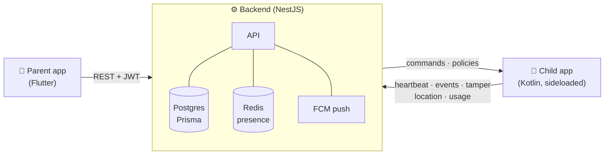

<div align="center">

# 🛡️ OpenParental

**Consent-first, open-source parental controls for Android.**

*Bypass-evident, not bypass-proof — the kid always knows it's there, and the parent always knows when it's off.*

[](https://github.com/Suhaib3100/openparental/actions/workflows/ci.yml)
[](LICENSE)
[](CONTRIBUTING.md)
[](android-managed)
[](app-parent)
[](backend)

[Why OpenParental?](#-why-openparental) •
[Features](#-features) •
[Architecture](#%EF%B8%8F-architecture) •
[Quick start](#-quick-start) •
[Roadmap](#%EF%B8%8F-roadmap) •
[Contributing](#-contributing)

</div>

---

## 💡 Why OpenParental?

Most parental-control apps compete on how well they *hide*: stealth modes, covert
screenshots, secret microphones. OpenParental makes the opposite bet — **supervision a
teenager can verify beats spyware they'll route around.**

- **Overt and consent-based.** The child app has a UI, says what it does, and
  shows what it reports. Nothing runs in secret.
- **Bypass-evident by design.** Without Device Owner you *can't* make an app
  un-killable — so OpenParental doesn't pretend to. Instead, every bypass (disabling
  accessibility, revoking a permission, force-stopping the app, the device going
  dark) becomes a **parent alert within minutes**. Turning it off is always
  possible — and never silent.
- **Hard privacy lines.** No covert audio or camera. No ambient recording. No
  covert screen capture. No server-side storage of minors' photos. No Device
  Owner / no device wipe. These are design constraints, not roadmap items.

## ✨ Features

| | Feature | How it works |
|---|---|---|
| 🔗 | **Pairing** | Parent generates a short code → child app claims it → device gets its own scoped token |
| 🔒 | **Remote lock & ping** | Command spine: enqueue → push/poll → device ack → result, fully audited |
| 🚫 | **App blocking** | Versioned policy engine — blocklists, per-app daily limits, schedules (e.g. no games after 9pm) |
| ⏱️ | **Screen-time limits** | Accessibility service bounces blocked / over-limit / out-of-schedule apps |
| 🚨 | **Tamper evidence** | Disabled accessibility, revoked permissions, force-stop, "went dark" — all surfaced as alerts |
| 🌙 | **Went-dark reconciler** | Presence tracked in Redis, reconciled from Postgres — a Redis restart never causes a false alarm |
| 🆕 | **New-app detection** | Parent is alerted when a new app is installed |
| 📍 | **Location** | Periodic location reporting to the parent dashboard |
| 📊 | **Usage visibility** | Daily per-app usage reported to the backend |
| 🔔 | **Alert feed** | Tamper, went-dark, new-app and unblock-request alerts in the parent app |

## 🏗️ Architecture



Three components, one monorepo:

```
openparental/
├── backend/           NestJS + Postgres (Prisma) + Redis + FCM
│   ├── src/           auth · pairing · devices · policies · commands ·
│   │                  events · heartbeats · tamper · alerts · locations
│   └── test/          68 unit tests + e2e
├── android-managed/   Kotlin child app (sideloaded APK)
│   └── app/           FGS supervisor · accessibility enforcement ·
│                      tamper watchers · heartbeat · visibility reporters
├── app-parent/        Flutter parent app (Play-store track)
│   └── lib/           login · pairing · dashboard · lock/ping ·
│                      policy editor · alert feed
└── .github/           CI: backend build+test, Android assemble, Flutter analyze
```

**The flow, end-to-end:** parent registers → creates a pairing code → child app
claims it → parent sees the device, sends **Lock**/**Ping**, edits a blocked-apps
policy that pushes to the device → the child app enforces it and reports
heartbeat, tamper, new apps, location and usage → parent gets alerts.

## 🚀 Quick start

**1. Backend** — Node 20+, Docker

```bash
cd backend
cp .env.example .env
docker compose up -d              # Postgres 16 + Redis 7
npm install
npm run prisma:generate && npm run prisma:migrate
npm run start:dev                 # → http://localhost:3000/health
```

**2. Child app** — JDK 17, Android Studio

Open `android-managed/` in Android Studio and run it on a device. In the app, set
the backend URL (`http://10.0.2.2:3000` from an emulator) and enter a pairing code.

**3. Parent app** — Flutter 3.22+

```bash
cd app-parent
flutter pub get
flutter run                       # set the backend URL on the login screen
```

Register, create a pairing code, type it into the child app — the device appears
on your dashboard.

## 🗺️ Roadmap

- [x] **v1 — enforcement, limits, tamper-evidence, location, alerts** (built, CI-green)
- [ ] **FCM push** — instant command delivery (device polls every 60s today; needs your Firebase project)
- [ ] **Per-OEM onboarding** — guided battery-exemption + special-access flow (Xiaomi/Samsung/etc.)
- [ ] **VPN content filter** — DNS-based filtering on a maintained filter base
- [ ] **v1.1 — live painting overlay**
- [ ] **v1.5 — consented WebRTC screen-view + AMBER mode** (text archive + on-device photo screening)

## 🧰 Tech stack

| Component | Stack |
|---|---|
| Backend | Node 20, NestJS, TypeScript, Prisma + Postgres 16, Redis 7, firebase-admin |
| Child app | Kotlin 2.0, AGP 8.6, Gradle 8.9, SDK 35, JDK 17 |
| Parent app | Flutter 3.22+, Dart |
| CI | GitHub Actions — backend build + 68 tests, `assembleDebug`, `flutter analyze` |

## 🤝 Contributing

Contributions are welcome — especially OEM survival reports (does the FGS anchor
survive overnight on your Xiaomi/Samsung/OnePlus?), enforcement edge cases, and
parent-app UX. See [CONTRIBUTING.md](CONTRIBUTING.md) to get started.

One rule is non-negotiable: PRs adding covert surveillance (hidden recording,
stealth modes, secret capture) will be declined — that's the whole point of the
project. See [why OpenParental?](#-why-openparental)

## 🔐 Security

Found a vulnerability? Please report it privately via
[GitHub Security Advisories](https://github.com/Suhaib3100/openparental/security/advisories/new) —
see [SECURITY.md](SECURITY.md).

## 📄 License

[MIT](LICENSE) © 2026 Suhaib

---

<div align="center">
<sub>If OpenParental's approach resonates with you, a ⭐ helps other parents find it.</sub>
</div>
